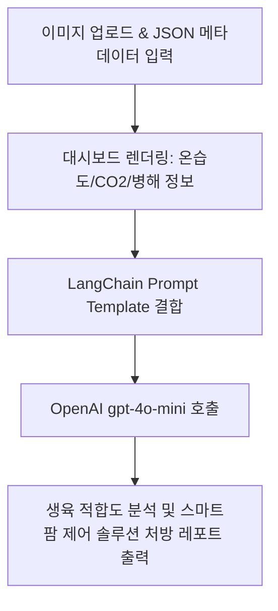

# 🍄 스마트팜 버섯 병해 및 생육 상태 AI 진단 서비스

버섯 이미지 분석에서 추출된 **AI Hub 표준 메타데이터**(센서 및 환경 정보)를 바탕으로, 컴퓨터 비전(YOLO) 진단 결과와 연동하여 OpenAI `gpt-4o-mini` 모델로부터 실시간 정밀 스마트팜 제어 처방 및 컨설팅 피드백을 제공받는 웹 애플리케이션입니다.

---

## 🌟 주요 기능 (Key Features)

1. **버섯 생육/병해 이미지 및 표준 메타데이터(JSON) 로드**
   - 이미지와 함께 AI Hub(스마트팜 통합데이터_버섯) 규격에 맞춘 JSON 형식의 분석 데이터를 입력받습니다.
2. **센서 및 환경 정보 시각화 (Dashboard)**
   - 메타데이터 내 실시간 측정값인 **온도(TEMPERATURE)**, **습도(HUMIDITY)**, **이산화탄소 농도(CARBON_DIOXIDE)** 수치를 Streamlit 대시보드 메트릭스로 출력합니다.
   - 객체 탐지 및 병해 발생 여부(`DBYHS_NORMALITY_ALTERNATIVE`, `DBYHS_SPCHCKN`)를 실시간으로 스캔합니다.
3. **LangChain & LLM 정밀 컨설팅 루프**
   - 센서 측정값 및 병해 분류 정보를 프롬프트로 가공하여 OpenAI `gpt-4o-mini` 모델로 전송합니다.
   - 현재 온도/습도/이산화탄소 조건이 버섯 품종에 적합한지 정밀 비교 분석합니다.
   - 병해 발생의 환경적 원인을 분석하고, 온도 하강/환기 작동 등 스마트팜 구동 제어 솔루션을 긴급 처방합니다.

---

## 🛠 기술 스택 (Tech Stack)

| 구분 | 기술 / 라이브러리 |
| --- | --- |
| **Frontend / Web UI** | [Streamlit](https://streamlit.io/) |
| **Computer Vision** | YOLO (Ultralytics PyTorch) |
| **LLM Orchestration**| [LangChain](https://www.langchain.com/) |
| **Language Model API**| OpenAI `gpt-4o-mini` |

---

## 📂 프로젝트 구조 (Project Structure)

```text
smhrd-mushroom-cv-llm/
├── models/
│   └── best.pt               # 버섯 생육/병해충 탐지용 YOLO 학습 가중치 파일
├── .env.example              # 환경 변수 템플릿 파일
├── .gitignore                # Git 제외 대상 설정 파일
├── mushroom_guide.md         # 버섯 품종별 최적 생육 환경 가이드라인 DB (Optional)
├── requirements.txt          # 패키지 의존성 정의 파일
└── streamlit.app.py          # Streamlit 대시보드 및 LLM 연동 메인 코드
```

---

## ⚙️ 데이터 규격 (실시간 전송 메타데이터 포맷)

본 프로젝트는 불필요한 하드코딩 데이터를 제외하고, 이미지 분석과 조절 센서값 기반의 동적 데이터만 정제하여 LLM으로 전송합니다:

```json
{
  "IMAGE": {
    "IMAGE_FILE_NAME": "KakaoTalk_20260630_142516605_03.jpg",
    "ANNOTATION_COUNT": 1
  },
  "ANNOTATION_INFO": [
    {
      "ID": 1,
      "BOUNDING_BOX_X_COORDINATE": 521,
      "BOUNDING_BOX_Y_COORDINATE": 1008,
      "BOUNDING_BOX_WIDTH": 367,
      "BOUNDING_BOX_HEIGHT": 352
    }
  ],
  "META": {
    "DBYHS_SPCHCKN": "푸른곰팡이병",
    "DBYHS_NORMALITY_ALTERNATIVE": false,
    "TEMPERATURE": 15.0,
    "HUMIDITY": 90.0,
    "CARBON_DIOXIDE": 1000.0
  }
}
```

---

## 🚀 시작하기 (Getting Started)

### 1. 가상환경 설정 및 의존성 설치
프로젝트 루트 디렉토리에서 아래 명령어를 실행하여 가상환경을 활성화하고 필요한 의존성 라이브러리를 설치합니다.

```bash
# 가상환경 생성
python -m venv .venv

# 가상환경 활성화 (Windows CMD/PowerShell 기준)
.venv\Scripts\activate

# 의존성 패키지 설치
pip install -r requirements.txt
```

### 2. 환경 변수 설정
설정 템플릿인 `.env.example` 파일을 복사하여 실제 환경 변수로 작동하는 `.env` 파일을 생성합니다.

```bash
# Windows CMD 복사 명령어
copy .env.example .env
```

복사하여 생성된 `.env` 파일을 열고, 본인의 OpenAI API 키를 기입해 줍니다:
```env
OPENAI_API_KEY=sk-proj-YourActualOpenAIKeyHere
```

### 3. 애플리케이션 실행
설정이 완료되면 아래 명령어로 Streamlit 웹 애플리케이션을 구동할 수 있습니다.

```bash
streamlit run streamlit.app.py
```

---

## 🔄 워크플로우 (System Workflow)


