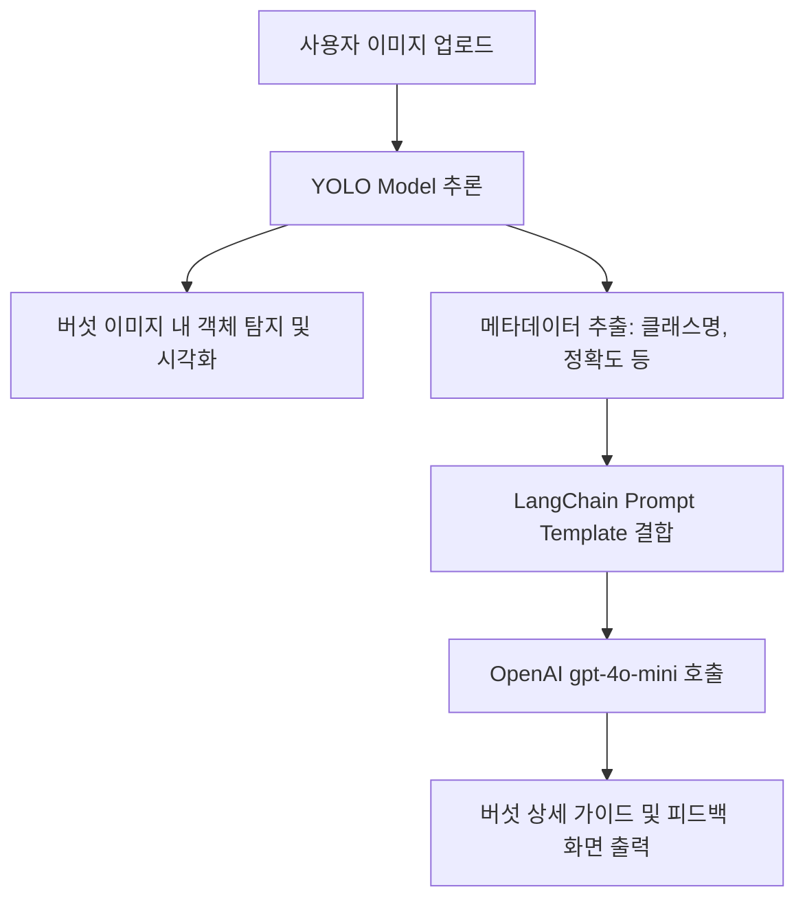

# 🍄 Mushroom CV & LLM Feedback System

버섯 이미지를 업로드하면 컴퓨터 비전(YOLO) 모델을 통해 버섯을 탐지(Detection)하고, 탐지 결과 메타데이터를 기반으로 LangChain을 통해 LLM(OpenAI `gpt-4o-mini`)으로부터 식용 여부, 버섯 정보 및 상세 피드백을 제공받는 웹 애플리케이션입니다.

---

## 🌟 주요 기능 (Key Features)

1. **버섯 이미지 업로드 및 실시간 객체 탐지 (Object Detection)**
   - 사용자가 버섯 이미지를 업로드하면 YOLO 모델을 통해 버섯을 인식하고 바운딩 박스(Bounding Box)를 시각화합니다.
2. **메타데이터 추출 (Metadata Extraction)**
   - 탐지된 버섯의 클래스(품종), 신뢰도(Confidence Score), 탐지 개수 등의 메타데이터를 추출합니다.
3. **LangChain & LLM 피드백 루프**
   - 추출된 메타데이터를 정의된 프롬프트 템플릿과 함께 OpenAI `gpt-4o-mini` 모델로 전송합니다.
   - 독버섯 여부 확인, 채취 시 주의사항, 생태 정보 등 전문가 수준의 맞춤형 가이드를 출력합니다.

---

## 🛠 기술 스택 (Tech Stack)

| 구분 | 기술 / 라이브러리 |
| --- | --- |
| **Frontend / Web UI** | [Streamlit](https://streamlit.io/) |
| **Computer Vision** | YOLO (Ultralytics PyTorch) |
| **LLM Orchestration**| [LangChain](https://www.langchain.com/) |
| **Language Model API**| OpenAI `gpt-4o-mini` |

---

## 📂 프로젝트 구조 (Project Structure)

```text
smhrd-mushroom-cv-llm/
├── models/
│   └── best.pt               # YOLO 학습 가중치 파일 (Custom Trained Weights)
├── .env.example              # 환경 변수 템플릿 파일
├── .gitignore                # Git 제외 대상 설정 파일
├── mushroom_guide.md         # 버섯 도감 정보 및 LLM 참조용 데이터베이스 (Optional)
├── requirements.txt          # 패키지 의존성 정의 파일
└── streamlit.app.py          # Streamlit 실행 메인 파일
```

---

## 🚀 시작하기 (Getting Started)

### 1. 가상환경 설정 및 의존성 설치
프로젝트 루트 디렉토리에서 아래 명령어를 실행하여 가상환경을 활성화하고 필요한 의존성 라이브러리를 설치합니다.

```bash
# 가상환경 생성 (Windows 예시)
python -m venv .venv
.\.venv\Scripts\activate

# 의존성 패키지 설치
pip install -r requirements.txt
```

### 2. 환경 변수 설정
`.env.example` 파일을 복사하여 `.env` 파일을 생성하고 필요한 API Key를 설정합니다.

```bash
copy .env.example .env
```

`.env` 파일에 아래 키를 기입합니다:
```env
OPENAI_API_KEY=your_openai_api_key_here
```

### 3. 애플리케이션 실행
설정이 완료되면 아래 명령어로 Streamlit 웹 애플리케이션을 구동할 수 있습니다.

```bash
streamlit run streamlit.app.py
```

---

## 🔄 워크플로우 (System Workflow)


