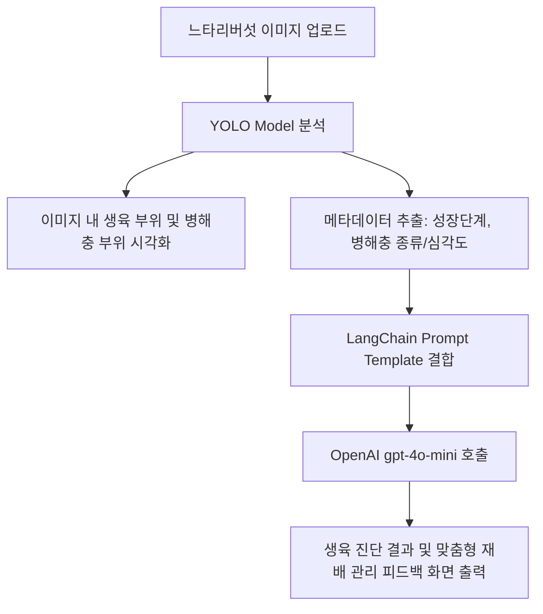

# 🍄 느타리버섯 생육 상태 및 병해충 진단 AI 피드백 시스템

느타리버섯 이미지를 업로드하면 컴퓨터 비전(YOLO) 모델을 통해 **생육 상태(성장 단계)**와 **병해충 발생 여부**를 탐지하고, 이 메타데이터를 기반으로 LangChain을 거쳐 OpenAI `gpt-4o-mini` 모델로부터 전문적인 재배 가이드 및 피드백을 제공받는 웹 애플리케이션입니다.

---

## 🌟 주요 기능 (Key Features)

1. **느타리버섯 이미지 업로드 및 객체 탐지 (Object Detection)**
   - 업로드된 느타리버섯 이미지 내에서 자실체의 위치를 인식하고 바운딩 박스로 시각화합니다.
2. **생육 단계 및 병해충 진단 메타데이터 추출**
   - YOLO 모델의 탐지 결과를 분석하여 **성장 단계**(예: 발이기, 생육기, 수확기 등) 및 **병해충 상태**(예: 정상, 푸른곰팡이병, 세균성갈색무늬병 등) 메타데이터를 추출합니다.
3. **LangChain & LLM 피드백 루프**
   - 탐지된 메타데이터를 프롬프트와 함께 OpenAI `gpt-4o-mini` 모델에 전달합니다.
   - 현재 생육 상태에 따른 재배 환경 제어법(온도, 습도, 환기 등) 및 감지된 병해충에 대한 대처법 등 맞춤형 컨설팅 피드백을 실시간으로 제공받습니다.

---

## 🛠 기술 스택 (Tech Stack)

| 구분 | 기술 / 라이브러리 |
| --- | --- |
| **Frontend / Web UI** | [Streamlit](https://streamlit.io/) |
| **Computer Vision** | YOLO (Ultralytics PyTorch) |
| **LLM Orchestration**| [LangChain](https://www.langchain.com/) |
| **Language Model API**| OpenAI `gpt-4o-mini` |

---

## 📂 프로젝트 구조 (Project Structure)

```text
smhrd-mushroom-cv-llm/
├── models/
│   └── best.pt               # 느타리버섯 생육/병해충 탐지용 YOLO 학습 가중치 파일
├── .env.example              # 환경 변수 템플릿 파일
├── .gitignore                # Git 제외 대상 설정 파일
├── mushroom_guide.md         # 느타리버섯 재배 매뉴얼 및 관리법 DB (Optional)
├── requirements.txt          # 패키지 의존성 정의 파일
└── streamlit.app.py          # Streamlit 실행 메인 파일
```

---

## 🚀 시작하기 (Getting Started)

### 1. 가상환경 설정 및 의존성 설치
프로젝트 루트 디렉토리에서 아래 명령어를 실행하여 가상환경을 활성화하고 필요한 의존성 라이브러리를 설치합니다.

```bash
# 가상환경 생성
python -m venv .venv

# 가상환경 활성화 (Windows CMD/PowerShell 기준)
.venv\Scripts\activate

# 의존성 패키지 설치
pip install -r requirements.txt
```

### 2. 환경 변수 설정
설정 템플릿인 `.env.example` 파일을 복사하여 실제 환경 변수로 작동하는 `.env` 파일을 생성합니다.

```bash
# Windows CMD 복사 명령어
copy .env.example .env
```

복사하여 생성된 `.env` 파일을 열고, 본인의 OpenAI API 키를 기입해 줍니다:
```env
OPENAI_API_KEY=sk-proj-YourActualOpenAIKeyHere
```

### 3. 애플리케이션 실행
```bash
streamlit run streamlit.app.py
```

---

## 🔄 워크플로우 (System Workflow)


